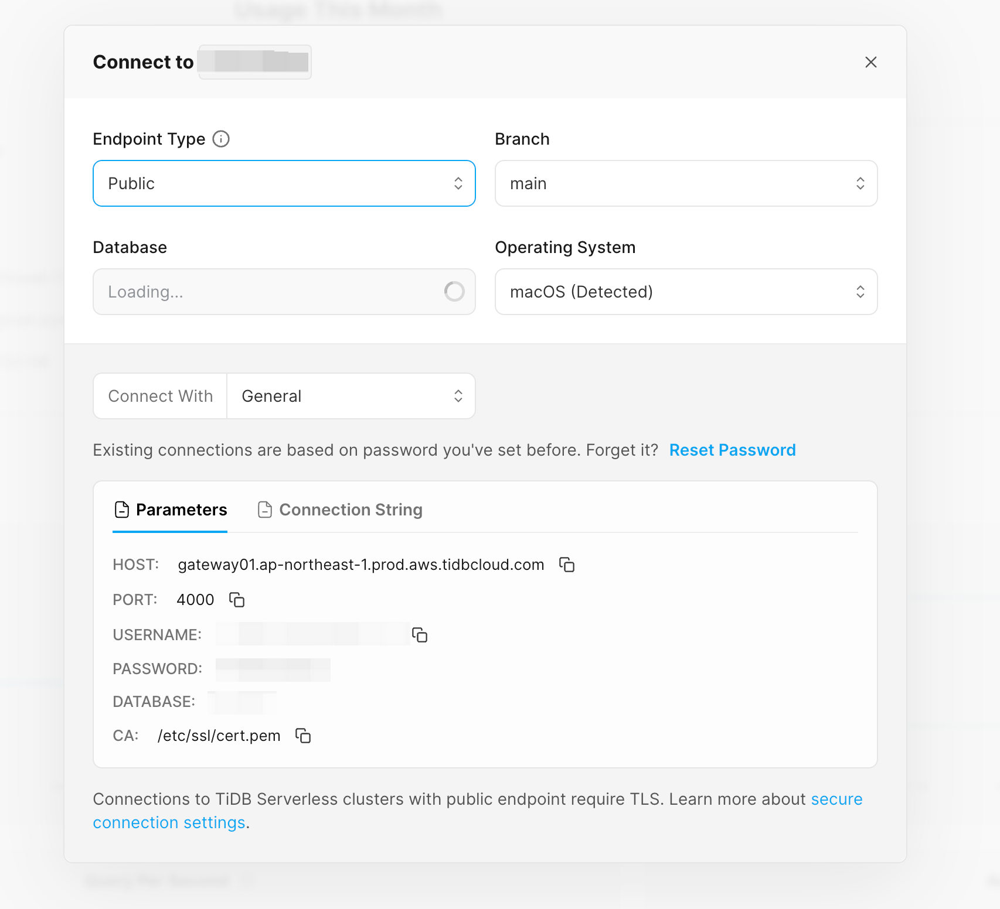

# Vector Examples

This directory contains examples of how to use the TiDB as a vector database.

## Prerequisites

Please make sure you have created a TiDB Serverless cluster with vector support enabled.

> Join the waitlist for the private beta at [tidb.cloud/ai](https://tidb.cloud/ai).

1. Sign up [TiDB Cloud](https://tidbcloud.com)
2. Follow this [tutorial](https://docs.pingcap.com/tidbcloud/tidb-cloud-quickstart#step-1-create-a-tidb-cluster) to create a TiDB Serverless cluster with vector support enabled
3. Navigate to the [Clusters](https://tidbcloud.com/console/clusters) page, and then click the name of your target cluster to go to its overview page
4. Click Connect in the upper-right corner.
5. In the connection dialog, select General from the Connect With dropdown and keep the default setting of the Endpoint Type as Public.
6. If you have not set a password yet, click Create password to generate a random password.

    <picture>
        
    </picture>
    
<i>The connection dialog of TiDB Serverless</i>

7. Save the connection parameters to a safe place. You will need them to connect to the TiDB Serverless cluster in the following examples.

## Examples

- [OpenAI Embedding](./openai_embedding/README.md): use the OpenAI embedding model to generate vectors for text data.
- [Image Search](./image_search/README.md): use the OpenAI CLIP model to generate vectors for image and text.
- [LlamaIndex RAG with UI](./llamaindex-tidb-vector-with-ui/README.md): use the LlamaIndex to build an [RAG(Retrieval-Augmented Generation)](https://docs.llamaindex.ai/en/latest/getting_started/concepts/) application.
- [Chat with URL](./llamaindex-tidb-vector/README.md): use LlamaIndex to build an [RAG(Retrieval-Augmented Generation)](https://docs.llamaindex.ai/en/latest/getting_started/concepts/) application that can chat with a URL.
- [GraphRAG](./graphrag-demo/README.md): 20 lines code of using TiDB Serverless to build a Knowledge Graph based RAG application.
- [GraphRAG Step by Step Tutorial](./graphrag-step-by-step-tutorial/README.md): Step by step tutorial to build a Knowledge Graph based RAG application with Colab notebook. In this tutorial, you will learn how to extract knowledge from a text corpus, build a Knowledge Graph, store the Knowledge Graph in TiDB Serverless, and search from the Knowledge Graph.
- [Vector Search Notebook with SQLAlchemy](https://colab.research.google.com/drive/1LuJn4mtKsjr3lHbzMa2RM-oroUvpy83y?usp=sharing): use [SQLAlchemy](https://www.sqlalchemy.org/) to interact with TiDB Serverless: connect db, index&store data and then search vectors.
- [Build RAG with Jina AI Embeddings](./jina-ai-embeddings-demo/README.md): use Jina AI to generate embeddings for text data, store the embeddings in TiDB Vector Storage, and search for similar embeddings.

## Real World Applications

### tidb.ai

[tidb.ai](https://tidb.ai) is an amazing out-of-the-box RAG(Retrieval Augmented Generation) template project based on the TiDB Vector store, it contains ui and server logic, fork it on [github](https://github.com/pingcap/tidb.ai) and build your own application.

